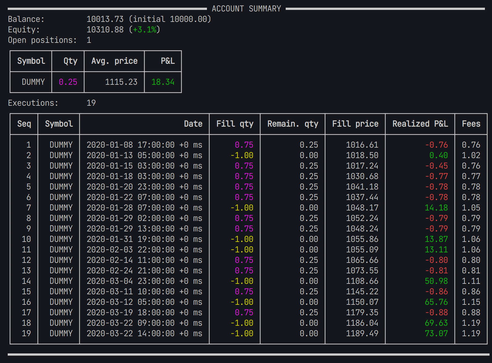

# Fastback.jl - Blazing fast Julia backtester 🚀

[](./LICENSE)


Fastback provides a lightweight, flexible and highly efficient event-based backtesting library for quantitative trading strategies.

The main value of Fastback is provided by the account and bookkeeping implementation.
It keeps track of the open positions, account balance and equity.
Furthermore, the execution logic supports fees, slippage, partial fills and execution delays in its design.

Fastback does not try to model every aspect of a trading system, e.g. brokers, data sources, logging etc.
Instead, it provides basic building blocks for creating a custom backtesting environment that is easy to understand and extend.
For example, Fastback has no notion of "strategy" or "indicator", such constructs are highly strategy implementation specific and therefore up to the user to define.

The event-based architecture aims to mimic the way a real-world trading systems works, where new data is ingested as a continuous data stream, i.e. events.
This reduces the implementation gap from backtesting to real-world execution significantly compared to a vectorized backtesting frameworks.

## Features

- Event-based
- Modular architecture, no opinionated black-box design
- Supports arbitrary pricing data source
- Supports modelling fees, execution delays, price slippage and partial fills
- Flexible data collectors to collect time series like account equitity history, number of open positions, etc.
- Facilities for parallelized backtesting and hyperparameter optimization
- Uses position netting approach for bookkeeping
  - Maintains single position per instrument using weighted average cost method

## Examples

### Random Trading Strategy

<details>

<summary>Click to expand code</summary>

Code file, see [examples/random_trading.jl](examples/random_trading.jl).

```julia
# Random trading strategy example
# -------------------------------
# This dummy example demonstrates how to backtest a simple random trading strategy
# using synthetic data generated in the script.
# The price series is a random walk with a drift of 0.1 and initial price 1000.
# 
# The strategy randomly buys or sells an instrument with a probability of 1%.
# Buy and sell orders use the same price series, implying a spread of 0.
# Each trade is executed at a fee of 0.1%.
# For the sake of illustration, only 75% of the order quantity is filled.
#
# The account equity and drawdowns are collected for every hour
# and plotted at the end using UnicodePlots.

using Fastback
using Dates
using Random

# set RNG seed for reproducibility
Random.seed!(42);

# generate synthetic price series
N = 2_000;
prices = 1000.0 .+ cumsum(randn(N) .+ 0.1);
dts = map(x -> DateTime(2020, 1, 1) + Hour(x), 0:N);

# define instrument
DUMMY = Instrument(1, Symbol("DUMMY"));
instruments = [DUMMY];

# create trading account with 10,000 start capital
acc = Account{Nothing}(instruments, 10_000.0);

# data collector for account equity and drawdowns (sampling every hour)
collect_equity, equity_data = periodic_collector(Float64, Hour(1));
collect_drawdown, drawdown_data = drawdown_collector(DrawdownMode.Percentage, Hour(1));

# loop over price series
for (dt, price) in zip(dts, prices)
    # randomly trade with 1% probability
    if rand() < 0.01
        quantity = rand() > 0.4 ? 1.0 : -1.0
        order = Order(oid!(acc), DUMMY, dt, price, quantity)
        fill_order!(acc, order, dt, price; fill_quantity=0.75order.quantity, fee_pct=0.001)
    end

    # update position and account P&L
    update_pnl!(acc, DUMMY, price)

    # collect data for plotting
    collect_equity(dt, acc.equity)
    collect_drawdown(dt, acc.equity)
end

# print account statistics
show(acc)


# plot equity and drawdown
using UnicodePlots, Term

gridplot([
        lineplot(
            dates(equity_data), values(equity_data);
            title="Account equity",
            height=12
        ),
        lineplot(
            dates(drawdown_data), 100values(drawdown_data);
            title="Drawdowns [%]",
            color=:red,
            height=12
        )
    ]; layout=(1, 2))
```

</details>

**Output**

<details>

<summary>Click to expand output</summary>




</details>
