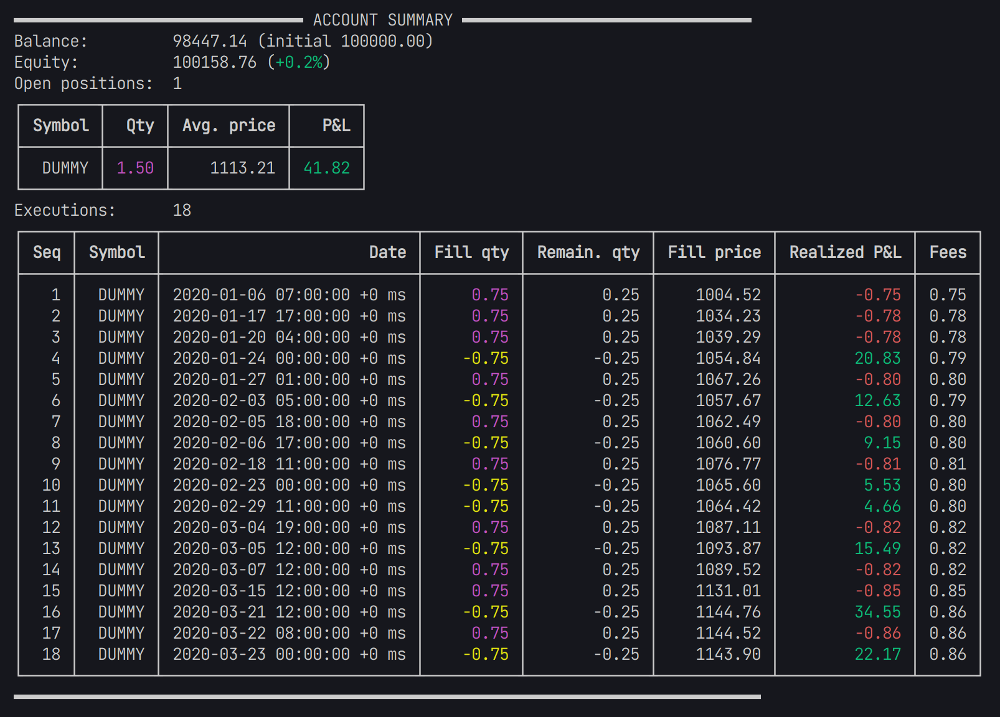

# Fastback.jl - Blazing fast Julia backtester 🚀

[](./LICENSE)


Fastback provides a lightweight, flexible and highly efficient event-based backtesting framework for quantitative trading strategies.

Fastback does not try to model every aspect of a trading system, e.g. brokers, data sources, logging etc., but rather provides basic building blocks to create a custom backtesting environment that is easy to understand and extend.

## Features

- Event-based
- Modular architecture, no opinionated black-box design
- Supports arbitrary pricing data source
- Supports modelling fees, execution delays, price slippage and partial fills
- Flexible data collectors to collect time series like account equitity history, number of open positions, etc.
- Uses position netting approach for bookkeeping
  - Maintains single position per instrument using weighted average cost method

## Example

Code file, see [examples/random_strategy.jl](examples/random_strategy.jl).

### Code

```julia
# Random trading strategy example
# -------------------------------
# This dummy example demonstrates how to backtest a simple random trading strategy
# using Fastback that randomly buys or sells an instrument with a probability of 1%.
# The strategy is applied to synthetic data generated in the script.
# The price of the instrument is a random walk with a drift of 0.1 and initial price 1000.
# Buy and sell orders use the same price series.

using Fastback
using Dates

# generate synthetic price series
N = 2_000;
prices = 1000.0 .+ cumsum(randn(N) .+ 0.1);
dts = map(x -> DateTime(2020, 1, 1) + Hour(x), 0:N);

# define instrument
DUMMY = Instrument(1, "DUMMY");
instruments = [DUMMY];

# create trading account
acc = Account{Nothing}(instruments, 100_000.0);

# data collectors for account equity and drawdown
collect_equity, equity_data = periodic_collector(Float64, Second(1));
collect_drawdown, drawdown_data = drawdown_collector(DrawdownMode.Percentage, (v, dt, equity) -> dt - v.last_dt >= Second(1));

# get position for instrument
pos = get_position(acc, DUMMY);

# loop over price series
for i in 1:N
    dt = dts[i]
    price = prices[i]

    # randomly trade with 1% probability
    if rand() < 0.01
        quantity = rand() > 0.5 ? 1.0 : -1.0
        order = Order(acc, DUMMY, dt, price, quantity)
        fill_order!(acc, order, dt, price; fill_quantity=0.75order.quantity, fees_pct=0.001)
    end

    # update position and account P&L
    update_pnl!(acc, pos, price)

    # collect data for analysis
    collect_equity(dt, acc.equity)
    collect_drawdown(dt, acc.equity)
end

# print account statistics
show(acc)
```

### Output

